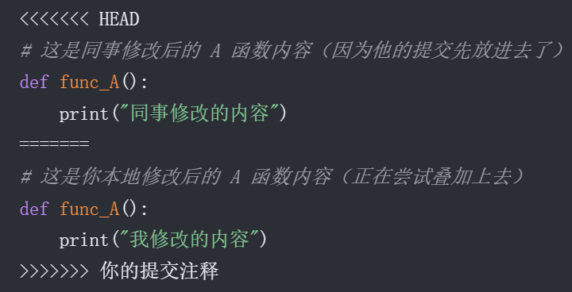
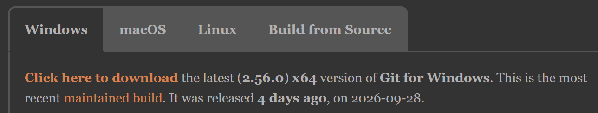
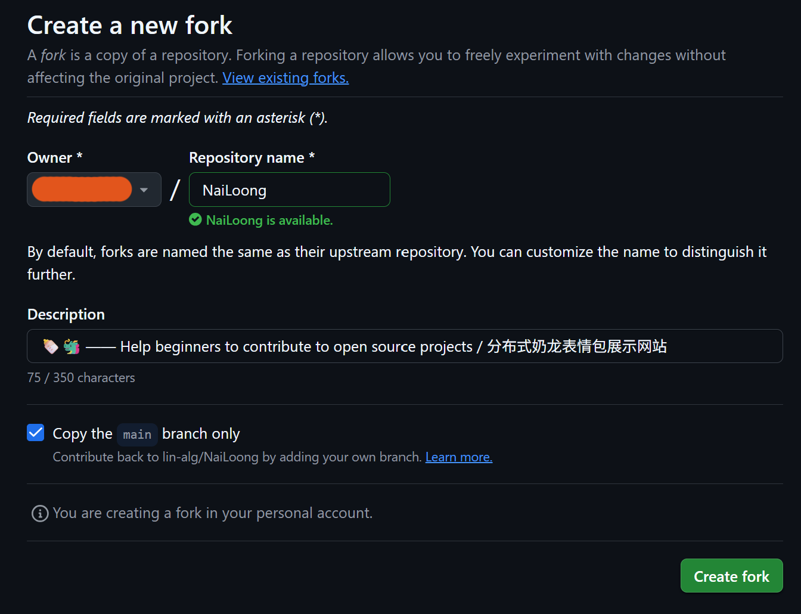
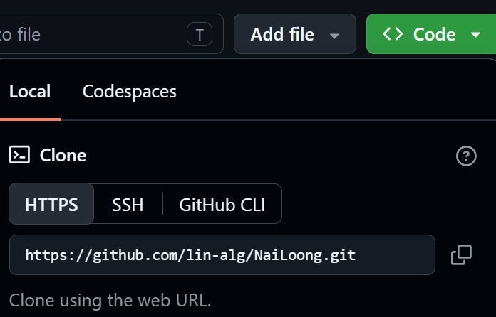
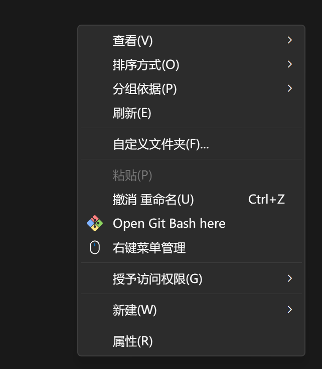
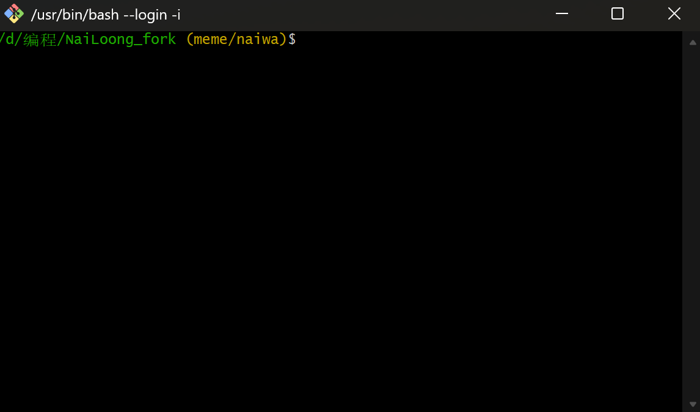
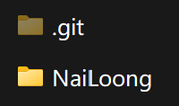
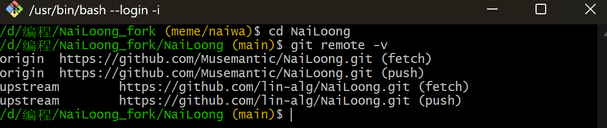
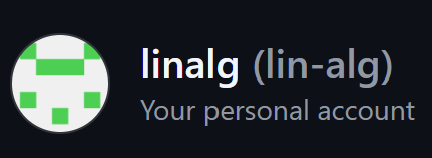
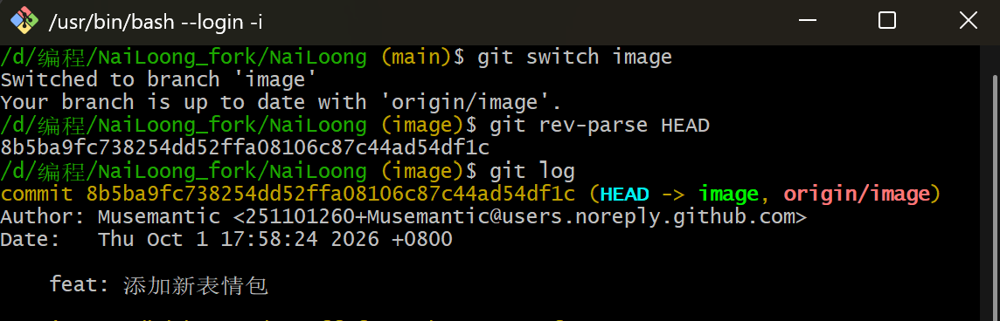

# GitHub 新手投稿教程

本教程适合想入门 GitHub 的新手，或者整理合并 [投稿区](https://github.com/lin-alg/NaiLoong/issues/1) 表情的贡献者。

> 有任何疑问，可以将这个文档和你的问题喂给AI，如果还是无法解答，可以直接提Issue咨询

如果你只想在投稿区上传表情，看 [社区投稿指南](meme-submissions.md) 即可。如果你是第二次投稿，请看 [再次投稿步骤](#再次投稿怎么操作) 。

## 一. 初识 Git

>如果你已经了解 Git 的使用，可以跳到[安装-git-并创建-fork](#二-安装-git-并创建-fork)

Git 本质上就是一个用于保存项目代码的不同版本，并追踪版本历史的工具。

### 1. 本地操作：add 和 commit

我们在本地写了一段代码很满意，想要记录这次修改，就需要保存一个新的版本，这个动作叫 **`commit`（提交）**。我们首先想到的是把整个项目文件夹添加为一个压缩包并用版本号命名，但是这样不仅占空间，而且还不方便管理。所以 commit 只记录文件变化了的部分。

我们不一定想把当前改动的所有文件都一次性存进去，可能只想存一部分，剩下的留到下个版本再提交。这时候就需要先用 **`add`** 把想要提交的文件放到“暂存区”，然后再 `commit` 暂存区里的修改。

---

### 2. 远程同步：push 和 pull

代码只保存在自己电脑上还不保险，或者要跟别人协作，就需要用到远程仓库（比如 GitHub）：

- 我们需要把本地的 commit 上传到远程仓库，就 **`push`（推）**。
- 我们需要把远程仓库的 commit 下载到本地，就 **`pull`（拉）**。

---

### 3. 多人协作与代码冲突

假设我们和同事正在开发 GitHub 上的同一个项目，两个人同时 pull 了仓库，得到仓库 main 分支上的最新版本。

main分支结构：
```
B --> A (B是最新的commit，指向A)
```
同事先改好代码，把本地的 `commit C` 推到了远程仓库。这时我们本地也做了一些改动想要提交 `commit D`，远程仓库就会迷糊：**“我到底是听他的，还是听你的？”**

所以 Git 要求我们必须先 pull 下来同事的最新版本，在本地处理好冲突再上传。这时候我们常用的命令是：
```bash
git pull --rebase origin main
```
`--rebase` 的作用是将我们本地的 `commit D`直接“拔起来”，追加在他的 commit 后面。

```
D
└ - C --> B --> A
```
此时 D 还未完全接在 C 上，会遇到两种情况：

- **情况 1**：如果我们和另一个人修改的位置不同，Git 会自动处理好，历史上看起来就是先后发生的两个版本。
  ```
  D --> C --> B --> A
  ```
- **情况 2**：如果我们和另一个人修改了相同的地方（比如都改了 `main.py` 里的 A 函数），rebase 就会停下来红字提示冲突：
  ```text
  CONFLICT (content): Merge conflict in main.py
  ```

此时打开编辑器，会有类似这种标记：

> 

我们需要人工做决策：到底是保留他的、保留我们的，还是结合一下给出最终版本？现代编辑器都可以很方便地点击按钮来选择。

处理完冲突并保存文件后，在终端输入 `git rebase --continue`（或者直接在VSCode等现代编辑器里点“继续”），直到所有冲突解决完毕，我们的 commit 就顺利接在最前面了。
```
  D --> C --> B --> A
```

---

### 4. rebase 和 merge 有什么区别？

你可能也听说过 `git merge`，它和 `rebase` 有什么区别呢？

- **rebase（变基）**：能保持提交历史是**一条直线**。它把你的修改拆下来，放到目标分支的最新节点之后，看起来像是在最新版本上顺理成章做出的改动。
- **merge（合并）**：会保留原始的分叉历史。它会新建一个特殊的“合并节点”`E`，把两个分叉再合并在一起。

如图所示：
```
┌------D------┐
↑             ↓
E --> C ----> B --> A
```

---

### 5. 团队协作进阶：Fork 与 Pull Request（PR）

在实际 GitHub 开源项目或团队协作中，主仓库通常受到保护，大家不能直接往 `main` 分支上 `push` 代码。这时候的标准流程是：

1. **Fork**：在 GitHub 页面上点击 Fork，把别人的主仓库完整复制一份到你自己的账号下。
2. **修改并推送**：把代码 clone 到本地修改，commit 之后，push 到**你自己账号下的仓库（origin）**。
3. **提 PR（Pull Request）**：去 GitHub 页面发起一个 Pull Request。这句话的意思其实就是向项目管理员喊话：“*我写好了新功能/修好了 Bug，请求（Request）你把我的代码拉（Pull）到你们的主仓库（upstream）里！*”
4. 管理员审核通过后点击同意，你的代码就正式并入项目主干了。

---

### 术语速查

- **仓库（repository）**：存放项目文件和所有版本修改记录的地方。
- **Fork**：复制源仓库到自己的 GitHub 账号下。本文中 `origin` 指你自己的 Fork 副本，`upstream` 指原始的主仓库（如 `lin-alg/NaiLoong`）。
- **分支（branch）**：一组独立的版本线。`main` 是默认的主分支。
- **Commit**：把暂存区的修改保存为一个版本，你可以理解成拍了一张“快照”。
- **Push**：把本地的新版本推送到远程 GitHub 仓库。
- **Pull**：把远程仓库的新版本拉取合并到本地。
- **Pull Request（PR）**：请求主仓库的维护者把你的分支修改合并到主仓库中。

你会在自己的 Fork 仓库中使用两种分支：

| 分支 | 用途 | 是否向主仓库发 PR |
| :--- | :--- | :--- |
| `image` | 长期保存原图 | 否 |
| `meme/naiwa-laugh` 等工作分支 | 提交这次投稿的 JSON 记录 | 是，合并到主仓库 `main` |

## 二. 安装 Git 并创建 Fork

1. Windows 用户安装 [Git for Windows](https://git-scm.com/downloads/win) 。下文所介绍的命令都在 Git Bash 中运行。


2. 登录 GitHub，打开 [lin-alg/NaiLoong](https://github.com/lin-alg/NaiLoong)，点击 **Fork → Create fork**。选项保持默认即可。




## 三. 克隆 Fork 仓库并同步主仓库

在你的 Fork仓库页面（注意不是主仓库！）点击"Code"，会弹出一个克隆链接，复制它：



（这里仅为示例，实际链接应为`https://github.com/<你的用户名>/NaiLoong.git`）

在你的电脑上新建一个项目文件夹，然后在文件夹内右键，选择`Open Git Bash here`，打开窗口：




图中的绿色字体代表我们当前的工作目录，黄色字体为当前仓库的分支（初始化仓库后才会显示）。

在Git Bash窗口中依次执行以下命令：
```bash
git clone https://github.com/<你的用户名>/NaiLoong.git # 克隆仓库时会自动初始化仓库
cd NaiLoong # 进入NaiLoong文件夹
git remote add upstream https://github.com/lin-alg/NaiLoong.git # 添加主仓库到上游
git remote -v # 查看当前 Git 仓库所关联的远程仓库地址
```
> 由于克隆下来的仓库可能不是根目录，所以需要`cd NaiLoong`进入根目录。



`origin` 应指向自己的 Fork，`upstream` 应指向 `lin-alg/NaiLoong`。后面的fetch、push分别指拉取和推送代码的远程地址，默认是相同的。

接着设置 commit 的署名，在 GitHub 的 **Settings → Emails** 处可以找到邮箱。

```bash
git config --global user.name "你的Github 用户名"
git config --global user.email "你的 GitHub 邮箱"
```

同步主仓库的最新内容：

```bash
git status
git fetch upstream main
git switch main
git merge --ff-only upstream/main
git push origin main
```

`status` 查看当前分支和改动，`fetch` 获取主仓库记录（仅获取main分支），`switch`切换分支，`merge --ff-only` 将刚才下载的 upstream/main 最新代码合并到当前的本地 main 分支，且强制使用快进模式。`push` 的作用是将更新推送到自己的远程仓库。首次 push 时，需按浏览器提示登录 GitHub 账号。
```
PS. Git的快进模式是什么？
ff-only的全称是fast-forward-only，指当本地有commit的时候，不允许合并。它未考虑是否能够自动 rebase。你也可以直接git switch main 再 git pull --rebase upstream main（等价于git fetch upstream main + git rebase upstream/main）。
```

## 四. 上传图片到 `image` 分支

准备静态图片或 GIF，单张严格不超过 **5 MB**，建议小于 2 MB。

处理投稿区图片时，选择“⚪ 未处理”的评论，右键另存为每张表情图片，保证下载的是原图，否则图片检查可能不通过。你也可以不从投稿区选图，而是上传自己的表情。

下面以 `meme.gif` 为例，介绍上传图片到 image 分支的流程。（image分支不要合并到其它分支！）

首先切换到image分支：
```bash
git switch -c image
```
在 `assets` 文件夹内建立 `memes` 文件夹，将 `meme.gif` 放进去，多个表情同理。

然后 add 所有表情文件并提交。
```bash
git add assets/memes/meme.gif
git status
git commit -m "feat: 添加新表情文件" # -m的意思是这次commit的说明
git push -u origin image # -u为分支设置默认推送地址，之后可以直接用git push。
git rev-parse HEAD # 获取这次commit的唯一标识，即哈希值。你也可以用git log命令，并记下最新的哈希。
```

**记下最后一条命令输出的 40 位 字符串**，这是图片上传 commit 的编号，供下一步的图片 URL 使用。图片URL的格式为：

```text
你的GitHub用户名/<40位commit哈希>/assets/memes/meme.gif
```

Github 用户名请填用户名而非昵称。比如下图括号中的名字即为用户名，左侧为昵称。



已有 `image` 分支时，无需重复创建，按 FAQ 中的 [再次投稿步骤](#再次投稿怎么操作) 操作即可。

> 

> 如图，commit 的哈希值为 8b5ba9fc738254dd52ffa08106c87c44ad54df1c
## 五. 创建工作分支并填写 JSON 字段

> 这里的其实可以用可视化工具操作，目前还未做好，稍微麻烦大家了~

回到主仓库的最新数据，创建这次投稿的工作分支：

```bash
git switch main
git fetch upstream
git merge --ff-only upstream/main
git switch -c meme/naiwa-laugh
```

`meme/naiwa-laugh` 是示例分支名，可以换成描述本次投稿的分支名字。

用文本编辑器打开 `data/manifest.json`，找到角色及其分类文件。例如奶蛙动图写入 `data/naiwa/animated.json`，奶蛙静态图写入 `data/naiwa/static.json`。

分类文件是一个数组，格式如下：

```json
[
  {
    "title": "奶蛙狂笑",
    "url": "你的GitHub用户名/<40位图片commit SHA>/assets/memes/meme.gif",
    "tags": [2, 0, 0]
  },
  {
    "title": "xxxx",
    "url": "xxxx",
    "tags": [1,null,0]
  }
  ...（省略)
]
```

已有记录时，在数组末尾追加一个大括号对象，给前一项补逗号；最后一项后面不加逗号。把标题和 URL 换成实际内容就好。

每个角色都有一个 `tags.json`。以奶蛙为例：

```json
{
  "smile": {
    "0": "轻松绷住",
    "1": "憋笑",
    "2": "大笑"
  },
  "age limit": {
    "0": "老少咸宜",
    "1": "朋友整活",
    "2": "重口"
  },
  "artistic merit": {
    "0": "下里巴人",
    "1": "日常",
    "2": "阳春白雪"
  }
}
```
奶蛙目前有三种标签，每种标签都可以选择对应的值。
所以 `[2, 0, 0]` 表示的是“大笑”，“老少皆宜”，“下里巴人”。

标签的值暂时不确定时写 `null`。例如 `[2, 0, null]` 表示你暂时还不知道这张表情包的艺术价值是怎么样的。不过最好是所有标签都选择一个固定的值。

如果你安装了 Python ，保存后运行 `python scripts/validate_data.py` 检查数据是否有错误。

## 六. 提交并创建 PR

下面以奶蛙动图为例；文件路径和分支名要换成自己的实际值。

```bash
git status
git add data/naiwa/animated.json
git status
git commit -m "feat: 添加奶蛙狂笑表情"
git push -u origin meme/naiwa-laugh
```

确认这里只包含本次 JSON 修改，再 commit 和 push。

1. 在浏览器打开自己的 Fork 仓库，点击 **Compare & pull request**。没有这个按钮时，进入 **Pull requests → New pull request**。
2. 目标选择 `lin-alg/NaiLoong` 的 `main`，来源选择自己 Fork 的 `meme/naiwa-laugh` 工作分支。
3. 查看 **Files changed**，确认只有JSON的改动，图片文件未修改。
4. 写明角色、分类和图片来源（如必要）。如果是整理投稿区的表情，请把改评论顶部的 `MEME-CLAIM-...` 口令复制粘贴进 PR 描述。确保**一个 PR 只认领一条评论**，并已收录该评论的全部图片。
5. 点击 **Create pull request**，等待 Github Action 检查代码。如有报错时查看详情，按 [FAQ](#pr-检查失败怎么修改) 重新更改代码，然后commit。

维护者审核并合并后，网站会自动生成预览图并更新。投稿者不用拉取仓库的`preview`分支。

## 修订已有表情

从最新 `main` 分支创建工作分支，在 `data/` 中搜索标题或 URL，找到原条目后修改。

- 只改标题或标签：保留原来的 `url`。
- 替换自己或他人的图片（比如原图不够清晰，原Fork仓库失效等）：上传新图到自己的 `image` 分支，再把原 URL 地址中的用户名和哈希值修改为自己的 GitHub 用户名和本次新 commit 的哈希值。
- 在 PR 描述中说明修改原因。

## 常见问题 / FAQ

### 合并后可以删除 JSON 工作分支吗？

可以，它已经完成这次投稿的合并。可在自己的 Fork 分支列表中删除 GitHub 上的 `meme/...` 分支；PR 页面默认提供 **Delete branch** 按钮。保留它也没有影响，下一次使用新的工作分支即可。

`image` 分支请**长期保留并保持公开**。它们是网站的原图来源，请不要把该分支合并到其它分支或删除（这对这个项目很重要）。

### 再次投稿怎么操作？

不用重新 Fork 仓库。在本地仓库中确认没有未提交改动，然后更新 `main`：

```bash
git status
git switch main
git pull --rebase upstream main
git push origin main
git switch image
git pull --ff-only origin image
```

如果 `image` 分支只在 GitHub 上存在，本地还没有，先运行 `git fetch origin`，再用 `git switch --track origin/image` 代替最后两条命令。

将新图片复制到 `assets/memes` 中，然后执行第 3 步中的 `add → commit → push → rev-parse HEAD` 流程，记下新哈希。再从最新 `main` 建立一个名字不同的工作分支继续。

### GitHub 上删除工作分支后，本地分支也会消失吗？

不会。本地仍保留自己的副本，可以先留着。想删除时，确认 PR 已合并、分支上没有其他要保留的工作，运行：

```bash
git switch main
git fetch upstream
git merge --ff-only upstream/main
git branch -d meme/naiwa-laugh
```

把 `meme/naiwa-laugh` 换成实际名称。如果 Git 提示分支尚未合并，就先保留，不必为了清理而强制删除。

### 不会填写角色标签怎么办？

无法判断的标签填写 `null`，在 PR 中说明。也可以使用对象格式，例如 `"tags": { "smile": "大笑", "age limit": null }`；省略的标签视为未知。

### PR 检查失败怎么修改？

打开检查详情，找到报错文件和条目。
1. JSON 错误：重点检查逗号、引号和括号。
2. 标签错误：对照检查该角色的 `tags.json`。

在同一工作分支上修改后运行命令：
  ```bash
  git add data/naiwa/animated.json
  git diff --staged
  git commit -m "fix: 修复问题以通过PR检查"
  git push
  ```
原 PR 会根据新的commit自动检查，不用重新创建PR。
如果提示认领图片不匹配，确认PR描述中只填了一个正确的MEME-CLAIM口令，收录了该评论全部原图，且没有压缩、转码或附加其他额外图片。
报错中的 `entry #0` 是数组第 1 项，`entry #1` 是第 2 项，以此类推。

如果问题仍未解决，请提Issue咨询。

### 本地有未提交改动，还能同步或切换分支吗？

先运行 `git status` 和 `git diff`。如果是当前工作分支要提交的内容，先 `add` 和 `commit`；暂时不想提交，可以用 `git stash` 命令保存。完成同步并回到原分支后，再运行 `git stash pop` 恢复工作区。

### 同步 `main` 到自己的origin时提示不能快进，或推送被拒绝怎么办？

只要确认本地 main 分支没有未备份的新表情代码（改动都在 image 或工作分支上），我们可以用 reset重置 Fork 的 main 分支：

```bash
git switch main
git fetch upstream
git reset --hard upstream/main
git push -f origin main
```
### Git 命令报错，应该检查什么？

| 报错 | 处理 |
| :--- | :--- |
| `git: 'switch' is not a git command` | 更新 Git；旧版本可用 `git checkout 分支名` 切换、`git checkout -b 分支名` 创建分支。 |
| `Author identity unknown` | 设置工作区的 `user.name` 和 `user.email`。 |
| `upstream already exists` | 运行 `git remote -v`，地址正确就不必再次添加。 |
| 推送认证失败 | 按 Git Credential Manager 的浏览器提示登录，不要把 GitHub 密码当作 Git 密码。 |

### 图片 404 或网站预览不正常怎么办？

图片 404 时，检查 Fork 是否公开、用户名、40 位 SHA 和路径是否正确。可以打开完整地址核对：`https://github.com/你的用户名/NaiLoong/blob/<图片SHA>/assets/memes/meme.gif`。

本地页面无法加载数据时，在仓库根目录运行 `python -m http.server 8080`，浏览器访问 <http://localhost:8080>，不要直接双击 `index.html`。

仍有问题时，在 PR 中贴出错误信息，请维护者协助；发出前遮住私人信息。
